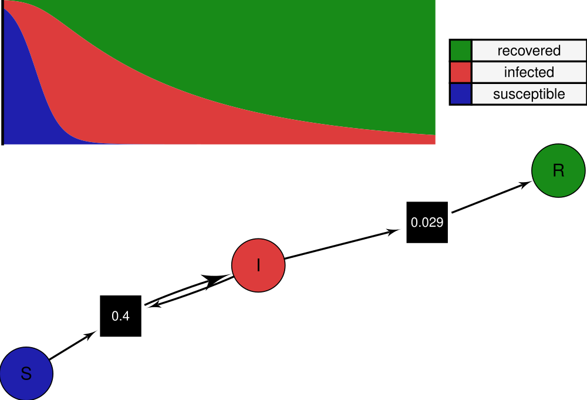
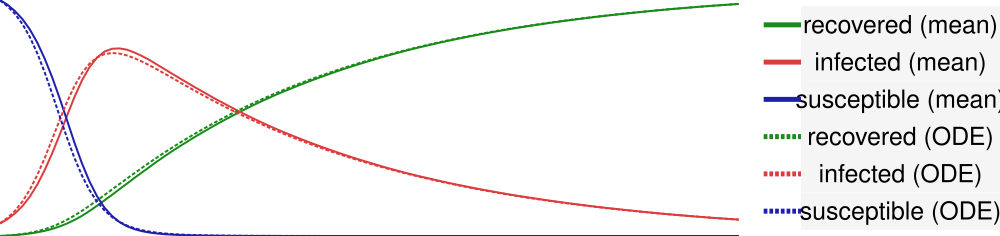
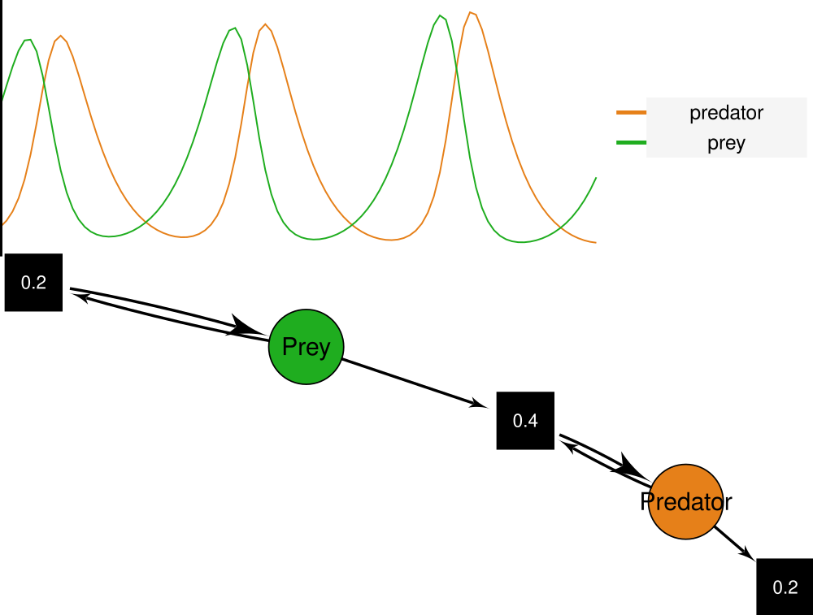
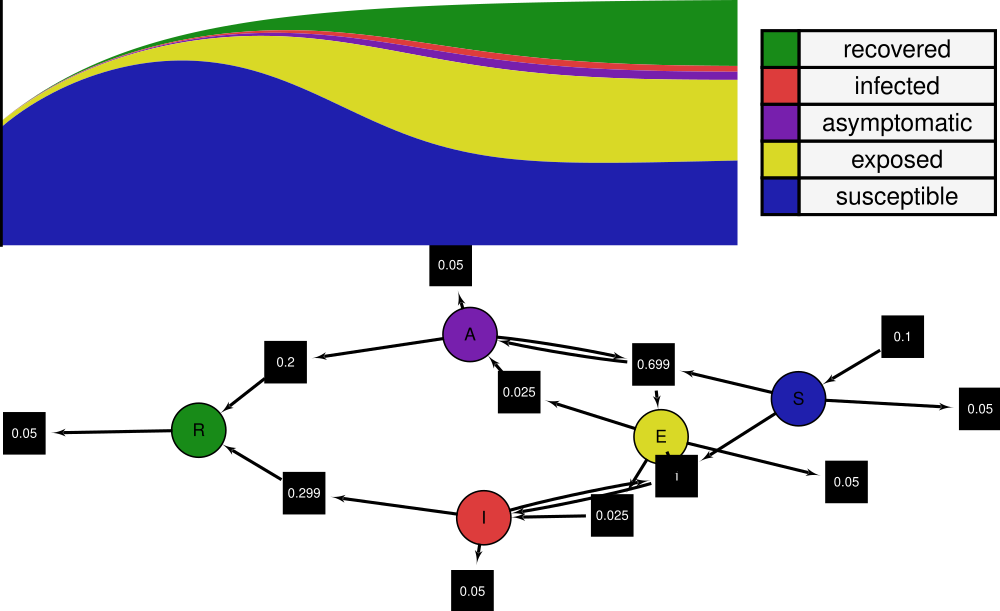
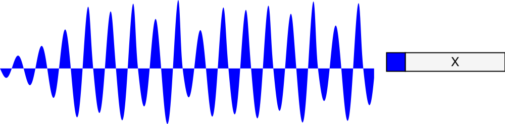
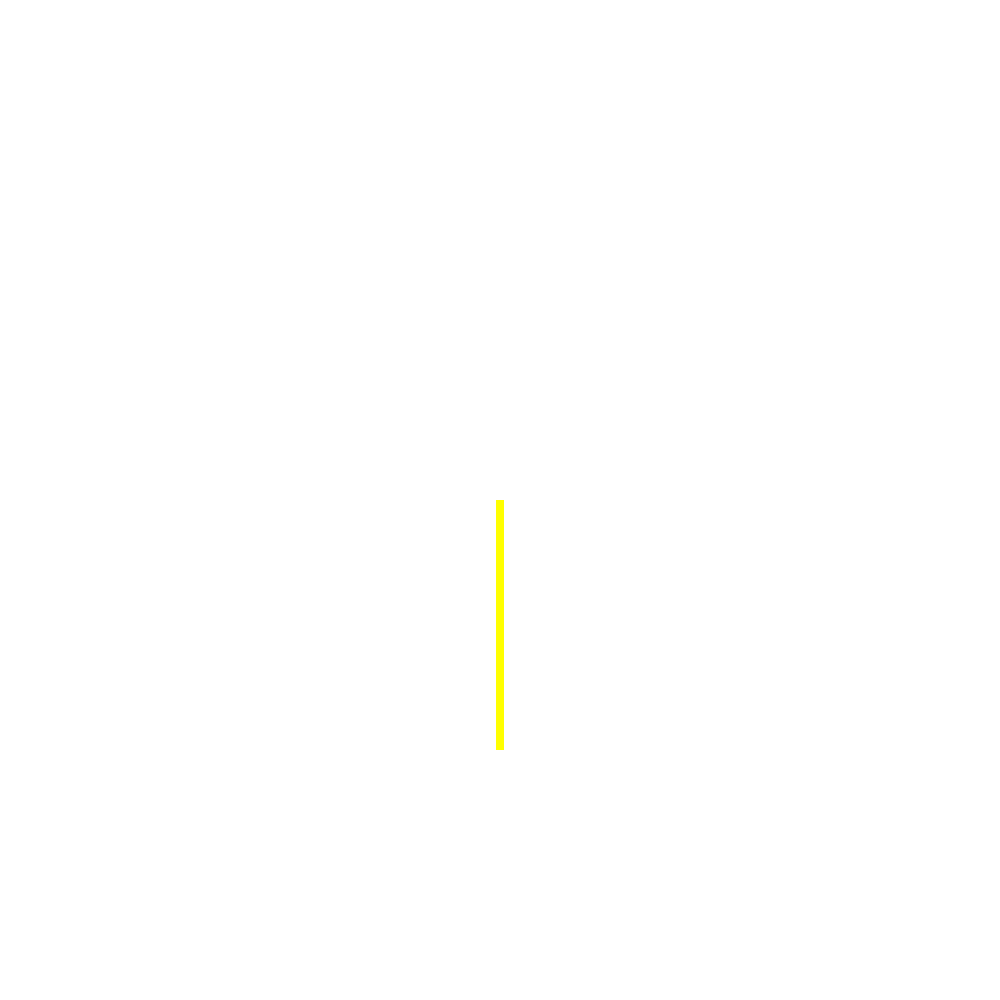
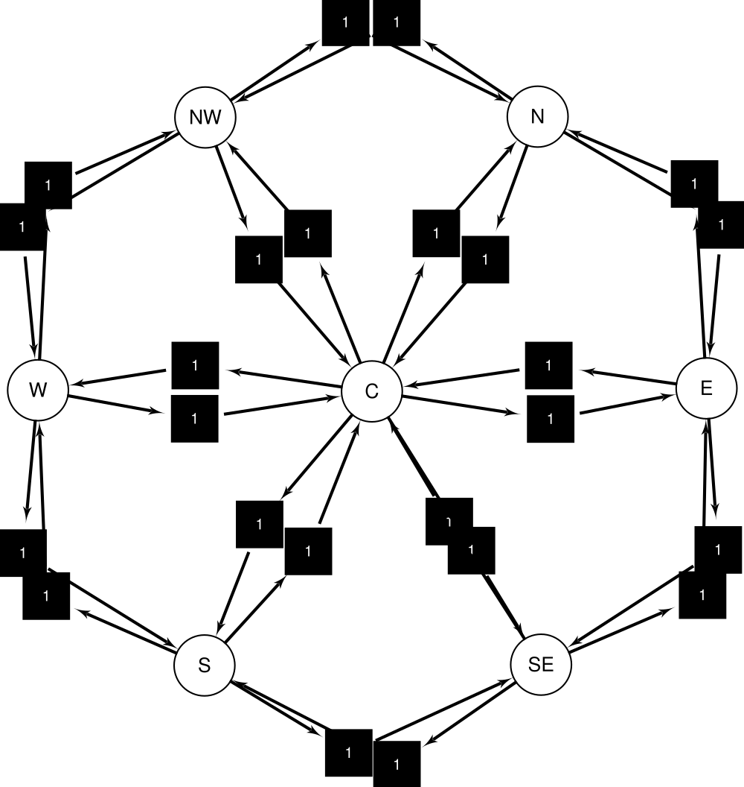

<div align="center">

# Agate

**Write a dynamical system down once. Run it as differential equations, simulate
it stochastically, and draw it, all from the same definition.**

[](http://www.haskell.org)
[](https://obsidian.systems)
[](LICENSE)



</div>

Agate is a Haskell library for modelling dynamical systems as
[Petri nets](https://en.wikipedia.org/wiki/Petri_net). A Petri net captures the
*structure* of a system (what flows into what, and at what rate), independently
of how you choose to read it. Agate turns that one structural description into
several interpretations: a deterministic ODE system, a stochastic process, an
incidence matrix for analysis, and an animated diagram.

## How it works

Here is the classic SIR epidemic, in which susceptible people become infected on
contact and infected people recover:

```haskell
sir :: (Place net ~ SIRPlace, Fractional (Transition net), PetriNet net) => net
sir =
    mconcat
        [ transition [I, S] transmission [I, I]   -- an I meets an S, producing two I
        , transition [I]    recovery     [R]      -- an I recovers to R
        ]
  where
    transmission = 0.4
    recovery     = 0.03
```

Notice the type: `sir` is polymorphic in `net`. It isn't an ODE, or a simulation,
or a picture. It is all of them, waiting to be chosen. The same `sir` value can be:

- **solved as ODEs**: mass-action kinetics give `S' = -βSI`, `I' = βSI - γI`,
  `R' = γI`, integrated with `solvePetri sir initialConditions`;
- **simulated stochastically**: transitions fire at Poisson-distributed rates (a
  form of the Gillespie algorithm), built on
  [LazyPPL](https://lazyppl-team.github.io/)'s probabilistic primitives;
- **analysed**: `pInvariants sir` discovers that `S + I + R` is conserved, with no
  modelling effort on your part;
- **drawn**: `layoutAndDrawPetri` lays the net out with GraphViz and renders it as
  an SVG whose places pulse with the population dynamics over time.

Building a bigger model is just `mconcat` of more transitions. The structure
composes monoidally, and every interpretation comes along for free.

## What's in the box

### Petri nets
A type class with a monoidal structure, so nets are assembled from individual
transitions. Ships with a concrete set-based implementation, mass-action ODE
semantics, incidence matrices, integer P-invariant computation, and
GraphViz-based diagrams, including animated SVGs that show populations evolving.

### ODE systems
A type class for first-order ODE systems, with instances for polynomial systems
(from mass-action kinetics) and arbitrary real-valued systems. Includes an Euler
solver and stacked-area / line-chart visualisation.

### Stochastic simulation
The same nets, read as continuous-time Markov chains. Transitions fire according
to Poisson rates, capped by available tokens, with Markov-kernel composition. The
test suite checks that the stochastic mean converges to the deterministic ODE
solution within a diffusion-approximation tolerance.



*The mean of 200 stochastic SIR runs (solid) tracking the deterministic ODE
solution (dashed).*

### Oriented graded posets
Representation and validation of oriented graded posets, enumeration of closed
subsets, and verification of algebraic identities.

## Worked examples

The `agate-examples` component is a gallery of ready-to-run models:

- **Epidemiology**: SIR, SIS, SIRS, SIRD, SEIR, SEAIR, SIWR
- **Population dynamics**: Lotka-Volterra, Malthusian growth
- **Physics**: double pendulum, Rössler attractor
- **General**: exponential growth

Each one defines its places and rates in a few lines, then gets charts, diagrams,
and (where applicable) stochastic trajectories for free.

<table>
  <tr>
    <td width="50%" align="center">
      <br>
      <sub><b>Lotka-Volterra</b>: predator/prey oscillation</sub>
    </td>
    <td width="50%" align="center">
      <br>
      <sub><b>SEAIR</b>: a richer compartmental epidemic</sub>
    </td>
  </tr>
  <tr>
    <td width="50%" align="center">
      <br>
      <sub><b>Rössler attractor</b>: chaotic dynamics</sub>
    </td>
    <td width="50%" align="center">
      <br>
      <sub><b>Double pendulum</b>: a non-polynomial system</sub>
    </td>
  </tr>
  <tr>
    <td colspan="2" align="center">
      <br>
      <sub><b>Madrid</b>: movement between geographic zones</sub>
    </td>
  </tr>
</table>

## Building

Agate uses Cabal:

    cabal build all
    cabal test

A Nix shell (`shell.nix`) provides the pinned GHC 9.12 toolchain and the
dependencies needed for diagram and animation rendering.

## About Obsidian Systems

Agate is built and maintained by **[Obsidian Systems](https://obsidian.systems)**. We provide frontier engineering for high-assurance systems, and we're long-time stewards of open-source Nix and Haskell tooling, including [Obelisk](https://github.com/obsidiansystems/obelisk), [Reflex](https://reflex-frp.org/), and [nix-thunk](https://github.com/obsidiansystems/nix-thunk).

If you're working on safe-by-design systems, formal modelling, or Haskell tooling and want a partner to help design, build, or ship it, we'd love to hear from you.

- Website: <https://obsidian.systems>
- Blog: <https://blog.obsidian.systems>
- GitHub: <https://github.com/obsidiansystems>

## Funding

Agate was developed as part of [ARIA](https://aria.org.uk/)'s
[Safeguarded AI](https://aria.org.uk/opportunity-spaces/mathematics-for-safe-ai/safeguarded-ai/funded-projects?tabId=tooling-platforms&cardId=obsidian-systems)
programme, within the *Mathematics for Safe AI* opportunity space.

## License

Agate is released under the [BSD-2-Clause License](LICENSE), © 2025 Obsidian Systems.
